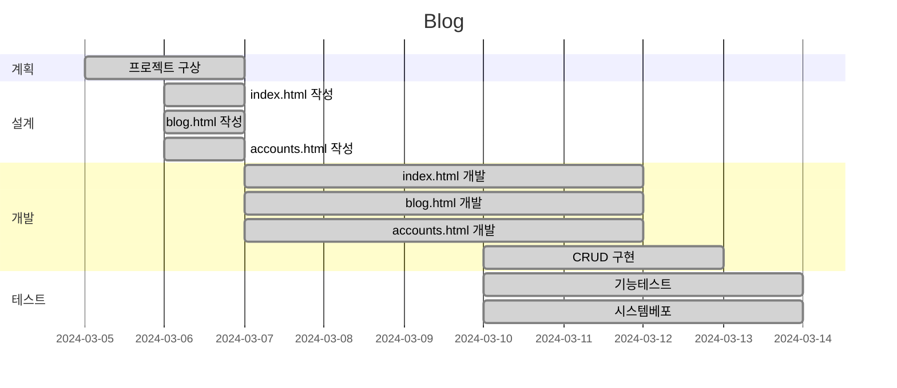
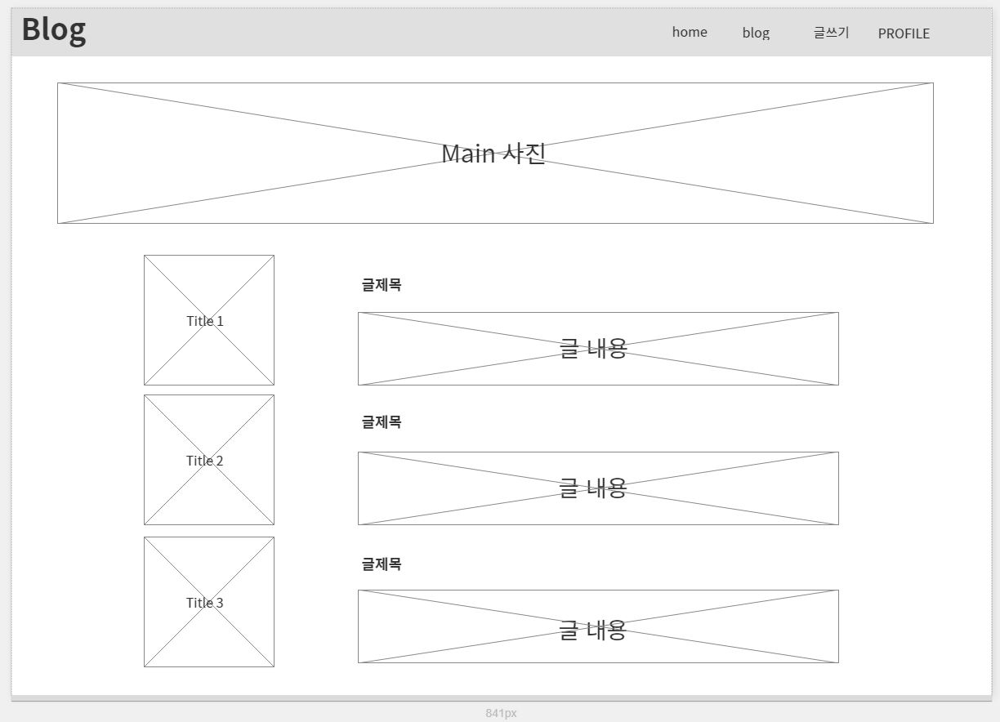
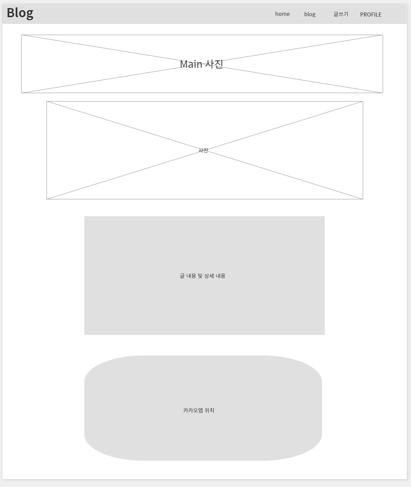
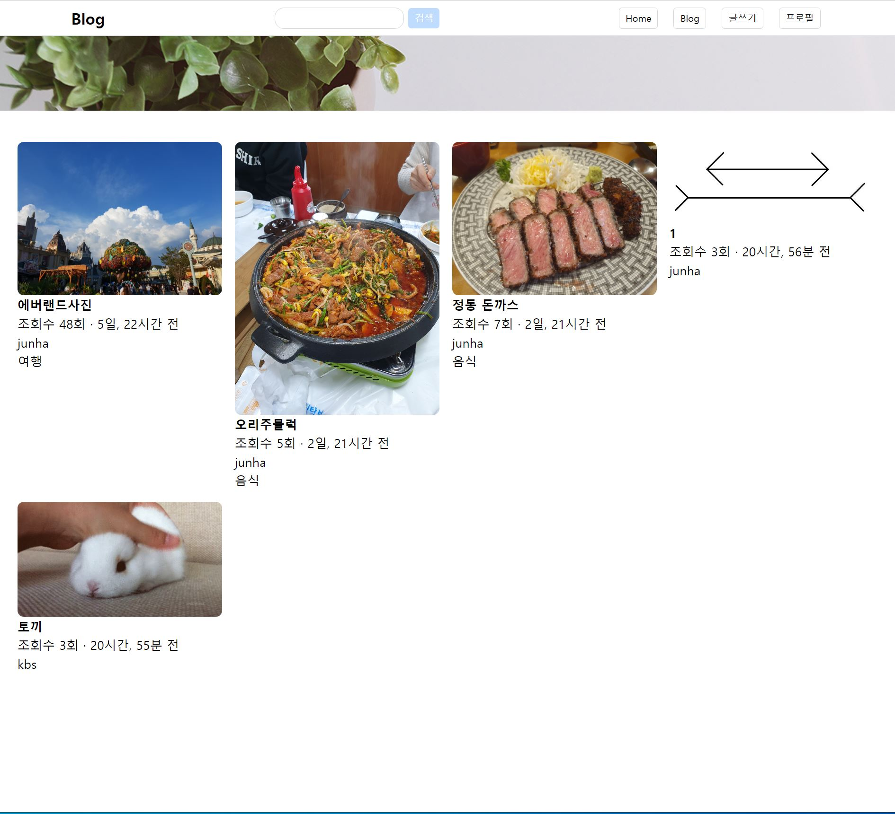

# Project-Blog
# 블로그

## 1. 소개
개인 블로그로 맛집과 여행 장소를 등록하기 위해 만들었습니다.

### 1.1 목표
- 다양한 기능 구현
- Django공부
- 
### 1.2 기능
- 기본적인 CRUD
- 로그인 / 회원가입
- 회원 프로필
- 블로그 메인 구현
- 간편 로그인 기능

## 2. 개발 프로그래밍 및 배포 URL
### 2.1 개발 프로그래밍
- Django 5.0.2 (Python 3.12.1)
- Pillow
- Django-tailwind


## WBS

```
📦accounts
 ┣ 📜admin.py
 ┣ 📜apps.py
 ┣ 📜context_processors.py
 ┣ 📜forms.py
 ┣ 📜mixins.py
 ┣ 📜models.py
 ┣ 📜tests.py
 ┣ 📜urls.py
 ┣ 📜views.py
 ┗ 📜__init__.py
 📦blog
 ┣ 📜admin.py
 ┣ 📜apps.py
 ┣ 📜forms.py
 ┣ 📜lookups.py
 ┣ 📜mixins.py
 ┣ 📜models.py
 ┣ 📜signals.py
 ┣ 📜tests.py
 ┣ 📜urls.py
 ┣ 📜views.py
 ┗ 📜__init__.py
 📦config
 ┣ 📜asgi.py
 ┣ 📜settings.py
 ┣ 📜test_settings.py
 ┣ 📜urls.py
 ┣ 📜wsgi.py
 ┗ 📜__init__.py
 📦main
 ┣ 📜admin.py
 ┣ 📜apps.py
 ┣ 📜mixins.py
 ┣ 📜models.py
 ┣ 📜tests.py
 ┣ 📜urls.py
 ┣ 📜utils.py
 ┣ 📜views.py
 ┗ 📜__init__.py
 📦static
 ┣ 📂css
 ┃ ┗ 📜styles.css
 ┣ 📂assets
 ┃ ┗ 📂images
 ┗ 📂js
 ┃ ┗ 📜scripts.js
📦templates
 ┣ 📂accounts
 ┃ ┣ 📜login.html
 ┃ ┣ 📜profile.html
 ┃ ┗ 📜singup.html
 ┣ 📂blog
 ┃ ┣ 📜blog_create.html
 ┃ ┣ 📜blog_detail.html
 ┃ ┣ 📜blog_list.html
 ┃ ┗ 📜blog_update.html
 ┣ 📂main
 ┣ 📜base.html
 ┗ 📜base1.html
┣ 📜db.sqlite3
┣ 📜manage.py
┣ 📜README.md
```


### URL 구조(모놀리식)
- main

| App       | URL                                        | Views Function    | HTML File Name                        | Note           |
|-----------|--------------------------------------------|-------------------|---------------------------------------|----------------|
| main      | '/'                                        | home              | main/home.html                        | 홈화면         |


- accounts
  
| App       | URL                                        | Views Function    | HTML File Name                        | Note           |
|-----------|--------------------------------------------|-------------------|---------------------------------------|--------------- |
| accounts  | 'signup/'                                  | signup            | accounts/signup.html                  |회원가입        |
| accounts  | 'login/'                                   | login             | accounts/login.html                   |로그인          |
| accounts  | 'profile/'                                 | profile           | accounts/profile.html                 |프로필          |


- blog
  
| App       | URL                                        | Views Function    | HTML File Name                        | Note           |
|-----------|--------------------------------------------|-------------------|---------------------------------------|----------------|
| blog      | 'blog/'                                    | blog_list         | blog/blog_list.html                   |갤러리형 게시판 메인 화면  |
| blog      | 'blog/<int:pk>/'                           | blog_detail       | blog/blog_detail.html                 |상세 포스트 화면    |
| blog      | 'blog/write/'                              | blog_create       | blog/blog_create.html                 | 카테고리 지정, 사진업로드, 게시글 조회수 반영|
| blog      | 'blog/edit/<int:pk>/'                      | blog_update       | blog/blog_update.html                 | 게시물목록보기 |
| blog      | 'blog/delete/<int:pk>/'                    | blog_delete       | blog/delete.html                      | 삭제 화면      |
| blog      | 'blog/search/'                             | search            | blog/search.html                      | 제목 검색     |


### EDR

### 와이어프레임

와이어프레임
    <table>
        <tr>
            <th>메인화면</th>
            <th>설명</th>
        </tr>
        <tr width="70%">
            <td width="70%">
                
            </td>
            <td>
                <ul>
                    <li>메인화면</li>
                    <li>사진 및 리스트</li>
                </ul>
            </td>
        </tr>
    </table>
    <table>
        <tr>
            <th>로그인 안되어 있을때</th>
            <th>설명</th>
        </tr>
        <tr>
            <td width="70%">
                
            </td>
            <td>
                <ul>
                    <li>로그인 안되어있을때</li>
                    <li>로그인 및 회원가입창</li>      
                </ul>
            </td>
        </tr>
    </table>
        <table>
        <tr>
            <th>블로그 화면</th>
            <th>설명</th>
        </tr>
        <tr>
            <td width="70%">
                
            </td>
            <td>
                <ul>
                    <li>블로그 화면</li>
                    <li>리스트 목록</li>         
                </ul>
            </td>
        </tr>
    </table>
        </table>
        <table>
        <tr>
            <th>블로그 글 선택시</th>
            <th>설명</th>
        </tr>
        <tr>
            <td width="70%">
                
            </td>
            <td>
                <ul>
                    <li>사진</li>
                    <li>글 내용 및 소개</li>
                    <li>맵 위치</li>                 
                </ul>
            </td>
        </tr>
    </table>


실제구현
    <table>
        <tr>
            <th>메인화면</th>
            <th>설명</th>
        </tr>
        <tr width="70%">
            <td width="70%">
                
            </td>
            <td>
                <ul>
                    <li>메인화면</li>
                    <li>사진 및 리스트</li>
                </ul>
            </td>
        </tr>
    </table>
    <table>
        <tr>
            <th>로그인 안되어 있을때</th>
            <th>설명</th>
        </tr>
        <tr>
            <td width="70%">
                
            </td>
            <td>
                <ul>
                    <li>로그인 안되어있을때</li>
                    <li>로그인 및 회원가입창</li>      
                </ul>
            </td>
        </tr>
    </table>     
